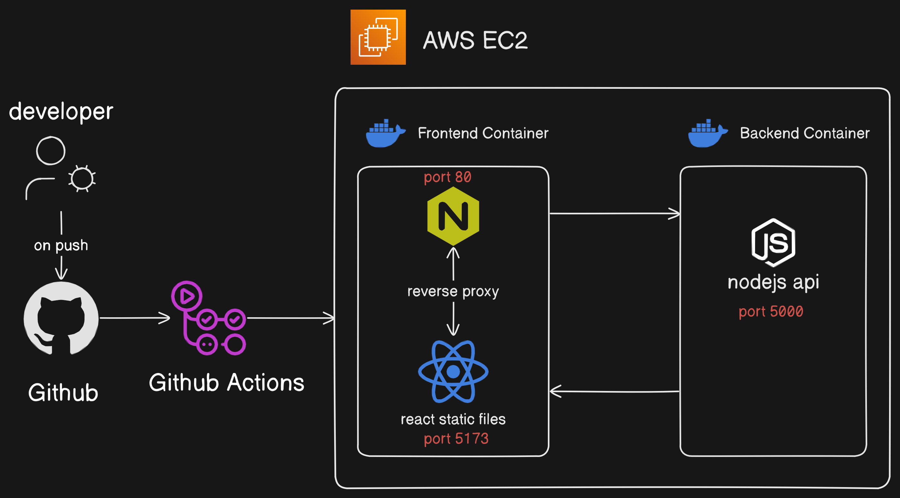

# HLS Video Transcoding Pipeline

## Video Transcoding
Video transcoding is the process of converting video files from one format or codec to another. This transformation is essential for ensuring compatibility with various devices, streaming services, and network conditions.

This Basically converts the input video from one resolution to single/multiple other resolutions. <br>
    
    eg : 720p to 480p, 360p, 144p

## HLS ?
HTTP Live Streaming (HLS) is an adaptive streaming communications protocol created by Apple. It is designed to deliver live and on-demand video content over the internet, allowing users to stream media efficiently.

## Process
1. **Encoding** <br>
Videos are encoded into multiple resolutions and bitrates to facilitate adaptive streaming. For example, a video might be transcoded into 240p, 360p, 480p, 720p, and 1080p formats. 
<br>    
    

1. **Segmentation** <br>
Transcoded videos are divided into small segments (e.g., 10 seconds each). This allows the player to download and buffer smaller pieces of the video rather than the entire file at once.
<br>    
    

1. **M3U8 Playlist Generation** <br>
M3U8 playlist file is generated that lists all the available segments and resolutions.
<br>    
    

## Project
This Project is an implementation of HLS Transcoding pipline. The tool which is used for transcoding is *ffmpeg*. This project uses an npm library of the software. <br>

### Backend Design


1. User initiates video upload.
2. The video is uploaded to an S3 bucket (temp).
3. An SQS listener is triggered whenever an video is uploaded. This sends a message into the queue along with the video key.
4. The server polls for the message.
5. It extracts the message by matching the video key and deletes the message from the queue.
6. It starts an container service using AWS ECS (Elastic Container Service). The image that this container uses was pushed beforehand. (image can be found in <a href="https://github.com/anshraiyani/hls-transcoding-pipeline/tree/main/hls-transcoder-service"> hls-transcoder-service </a>).
7. This marks the end of the req-res cycle. The API sends the video key as the response.
8. Concurrently, the user hits another endpoint with the video key as query params. This endpoint starts another polling service to monitor another SQS queue for changes in the prod bucket.
9. This container downloades the video from the key given in the enviroment variables, transcodes it and uploads it to another S3 bucket (prod).
10. Upload to the S3 triggers a message and is sent to the SQS.
11. The poller intercepts the message by again matching the key.
12. The message is deleted from the queue.
13. User is sent an hosted .m3u8 link.

### CI/CD Pipeline Design



### Run this project Locally

1.  Fill up the env variables in ``` backend ```, ``` frontend ``` and ``` hls-transcoder-service ```

1.  build the docker image of transcoding service:
    
    ``` docker build -t ./hls-transcoder-service/ ```
    
    use aws-cli to upload this to ECR

2.  run ``` docker-compose up ```